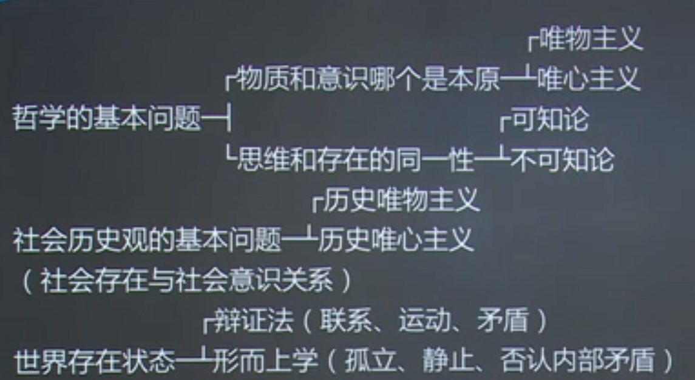
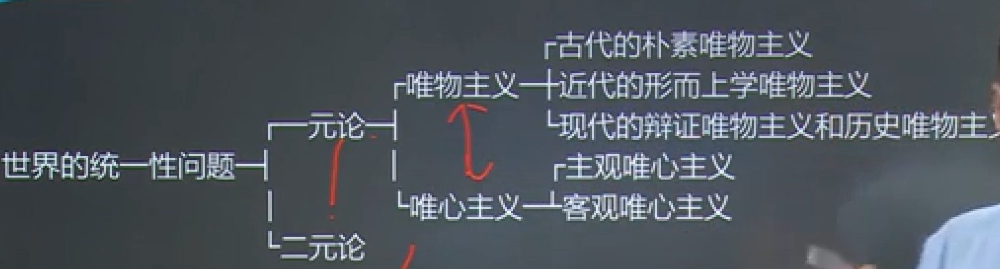

# 第 1 章 物质世界及其发展规律

世界是物质的，物质是运动的，运动是有规律的，规律是可以被认识的，认识是螺旋式上升、曲折前进的。

## 物质世界和实践

### 物质世界的客观存在

世界观是统一的物质世界。

世界观，就是人们对包括自然、社会和人类思维在内的整个世界的根本看法和根本观点。**思维**和**存在**或**意识**和**物质**的关系问题是哲学的基本问题。

✨：思维==意识 && 存在==物质

### 哲学的基本问题

**思维和存在或意识和物质的关系问题**是哲学的基本问题。

历史唯物主义：历史的发展跟人没关系，且有规律可循；

历史唯心主义：历史的发展跟人有关系，且无规律可循。

在唯物主义和唯心主义的对立中，又交织着辩证法和形而上学的对立。

辩证法和形而上学的对立从属于唯物主义和唯心主义的对立。

古代朴素唯物主义：世界由一个具体的东西组成的，比如火、水、金等。

✨：古希腊德谟克利特的原子论也属于古代朴素唯物主义。

二元论代表：法国哲学家笛卡尔。

主观唯心主义：以人为中心，存在就是被感知，物是感觉的集合。

客观唯心主义：以上帝（绝对精神）为中心。

### 唯物主义哲学随着社会实践和科学的发展

✨：马克思是唯物主义。

经历了三种基本形态：

* 古代的朴素唯物主义  

  古代朴素唯物主义把世界的本质或本原归结为某一种或某几种具体的物质形态。古代朴素唯物主义的最高成就，是古希腊德谟克利特的“原子论”和中国的“元气说”；

* 近代的形而上学唯物主义

  近代形而上学唯物主义以当时在自然科学中占主导地位的原子论为依据，把**原子**看成是世界的本原，认为原子是构成世界万物的最小单位。

  **形而上学唯物主义四个明显的局限性：**

  1. 机械性；
  2. 形而上学性；
  3. 直观性；
  4. 不彻底性。

* 现代的辩证唯物主义和历史唯物主义

  辩证唯物主义和历史唯物主义是彻底的唯物主义一元论，其基本思想是：

  承认世界的统一性，坚持一元论，反对二元论。认为世界统一于物质，坚持唯物主义一元论，反对唯心主义一元论，认为世界是运动发展的、无线多样性的统一，克服了旧唯物主义把世界的本原归结为某一种或某几种具体的物质形态的局限性。辩证唯物主义和历史唯物主义关于世界物质统一性的原理，是人类认识长期发展的结晶，被自然科学和哲学的长期发展所证明。自然界是客观的。人和人类社会是客观的（形成过程、存在和发展的基础）。

  只有马克思主义哲学对世界的本质问题做出了科学的解释，指出世界的本质或本原是物质，世界是客观存在的物质世界。

### 物质的定义

列宁指出：

物质是标志客观存在的哲学范畴，这种客观存在是人通过感觉感知的，它不依赖于我们的感觉而存在，为我们的感觉所复写、摄影、反映。

简言之，物质是不依赖于意识又能为意识所反映的客观实在。物质的唯一特性是**客观实在性**。

列宁的物质定义具有十分重要的意义：

1. 它指出物质是不依赖于意识的客观存在，同唯心主义划清了界限；

2. 它指出物质是可以被人们认识的，同不可知论划清了界限；

3. 它指出客观实在性是一切物质的共性，克服了旧唯物主义物质观的局限性。

   （自然科学的物质概念与哲学的物质概念，能很好地说明物质世界的多样性）

### 运动是物质的根本属性

**1. 物质与运动**

**运动**是物质的根本属性和存在方式。运动时标志物质世界一切事物和现象的变化和过程的哲学范畴。

运动是物质的固有属性，物质和运动不可分。

一方面，世界上不存在脱离运动的物质，世界上的一切事物无一不是处在运动中。另一方面，世界上也不存在没有物质的运动。形而上学主张没有运动的物质和唯心主义后者主张没有物质的运动。**

**2. 相对静止**

所谓相对静止，是标志物质运动在一定条件下、一定范围内处于暂时稳定和平衡状态的哲学范畴。相对静止主要有以下两种情形：第一，一个事物对另一个事物来说没有发生位置的位移。第二，事物的质没有发生根本变化，即事物质的相对稳定性。

承认事物相对静止的存在具有重要意义：

* 理解事物的多样性，区分开不同的事物；
* 认识事物分化的条件和生命现象的产生；
* 理解绝对运动。

世界上的事物都是绝对运动和相对静止的统一。形而上学、相对主义共同错误在于把绝对运动和相对静止相割裂。

### 时间和空间是物质运动的存在方式

**1. 时间与空间**

时间是物质运动的**持续性**、**顺序性**。时间的特性是**一维性**。

空间是物质运动的**广延性**和**伸张性**。物质的空间特性通常以两种形式表现出来：体积、空间位置是三维型。时间和空间是内在统一不可分离的（四维时空概念）。

**2. 时间空间与物质**

时间和空间是运动着的物质的存在方式，时间和空间与运动着的物质不可分离，世界上既没有脱离时间和空间运动的物质，也没有脱离物质运动的时间和空间。

### 实践的定义

一般来说，实践主要是指主体变革世界的活动，同时也包括探索性活动。 

实践具有以下三个基本特点：

* 客观性。从根本上与唯心主义实践划清界限；
* 自觉能动性。从根本上与旧唯物主义实践观划清界限；
* 社会历史性。同唯心主义实践观划清界限，又同旧唯物主义实践观以及实用主义实践观区别开来。三个特点是密切联系在一起的。

实践有以下三种基本形式：

* 物质生产实践；
* 处理社会关系的实践；
* 科学实验。其它一些实践形式（教育实践、医疗实践、艺术实践）。

### 人生活于其中的世界是与人的实践相联系的物质世界

* 第一，人的实践活动与自然界的二重化。人实践的观点把马克思主义自然观与旧唯物主义自然观区别开来。

* 第二，社会历史是人们实践活动创造的。旧唯物主义之所以仅仅在自然观上坚持唯物主义，在历史观上却陷入唯心主义，主要就是由于它缺乏实践的观点，一方面，它把人类生活于其中的自然看成纯粹客观的自在的东西；另一方面，他又把人的实践活动看成是纯粹主观的东西。用物质资料的生产活动和生产的发展去说明社会历史的发展，也就是用物质的原因去说明社会历史，这才有了历史唯物主义。**实践**的观点是马克思主义社会历史观的基础。

* 第三，实践是人的存在方式。实践的观点是马克思主义关于人的观点的基础。

## 社会生活在本质上是实践的

实践是人类社会产生、存在和发展的基础是社会生活的本质。

第一，劳动实践是人类和人类社会产生的决定性环节。

第二，物质生产实践是人类社会得以存在的基础。

第三，实践活动是推动社会发展的动力。

## 物质世界的普遍联系和永恒发展

联系是指事物之间以及事物内部诸多要素之间的相互影响、相互作用和相互制约。

事物（自然界、社会）之间的联系是客观的。

### 世界的运动发展

发展是指一种特殊的运动变化——上升性、前进性的运动变化。

发展的实质是事物的产生和旧事物的灭亡。

**新事物**是指符合事物发展规律、具有强大生命里和远大前途的事物。**旧事物**是指丧失了其存在的必然性、日趋灭亡的事物。

### 两种对立的发展观

**唯物辩证法**是关于自然、社会和思维联系和发展一般规律的科学。

**对立统一规律**揭示了事物发展的**动力**和**源泉**。

**质量互变规律**揭示了事物发展的**状态**和**形式**。

**否定之否定规律**揭示了事物发展的**趋势**和**道路**。

**对立统一规律**是唯物辩证法的实质与核心。

### 矛盾的普遍性和特殊性

矛盾是普遍存在的。简言之，矛盾无处不在，无时不有

### 质量互变规律

任何事物都是质和量的统一体。质和量是相互依赖、相互制约的。

量变和质变是事物发展变化的两种状态。量变是事物数量的递减和场所的变更。质变是事物根本性质的变化，是事物由一种质态向另一种质态的飞跃。

事物的变化是否超出度的范围，是区分量变和质变的**根本标志**。

### 否定之否定规律

**1. 辩证的否定**

任何事物内部都包括着肯定和否定两个方面。

## 客观规律性与主观能动性

规律就是物质运动发展过程中本质的、必然的、稳定的联系。

规律是一种本质的联系，是指规律一种内在的、非表面现象的联系，只有通过抽象思维才能把握。

规律性与必然性是同等程度的概念。

重复性是稳定性的表现。

规律的两个特点：第一，**客观性**；第二，**普遍性**。

✨：客观性是指规律本身不被人为影响。

社会发展规律是通过人们的自觉活动实现的。

### 意识及其能动作用

首先，**意识**是自然界长期发展的产物。

其次，**意识**是社会性劳动的产物。

劳动产生了语言，为意识的内容提供了物质器官。

意识从本质上看，意识是人脑的机能，是客观世界的主观映像，是社会的产物。

反射分为**无条件反射**和**条件反射**两类。

物质第一性，意识第二性。

意识的能动性主要表现在以下四个方面：

* 意识活动具有目的性和计划性；
* 意识活动具有主动创造性；
* 意识对于人的生理活动就有一定影响作用；
* 意识能通过指导实践改造客观物质世界。这是意识的能动性最突出的表现。 

## 解放思想，实事求是

实事求是是马克思主义哲学的**精髓**。