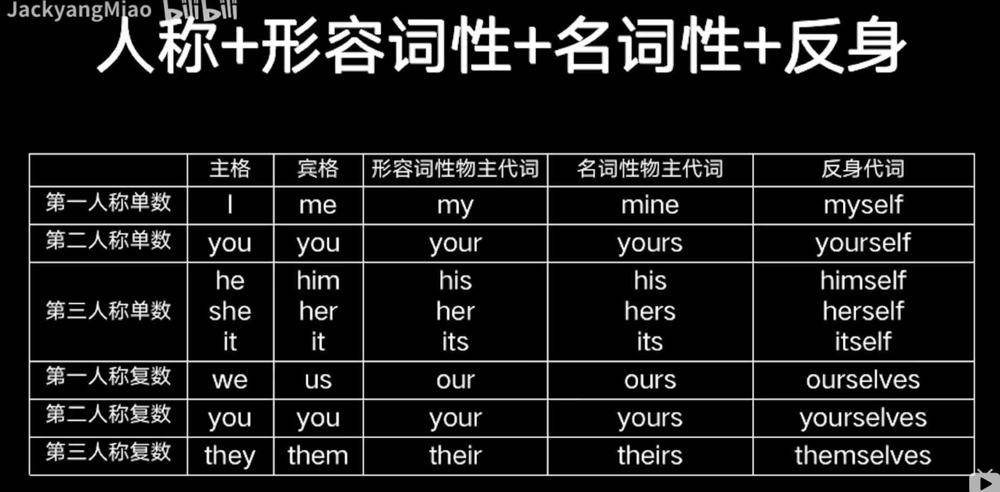
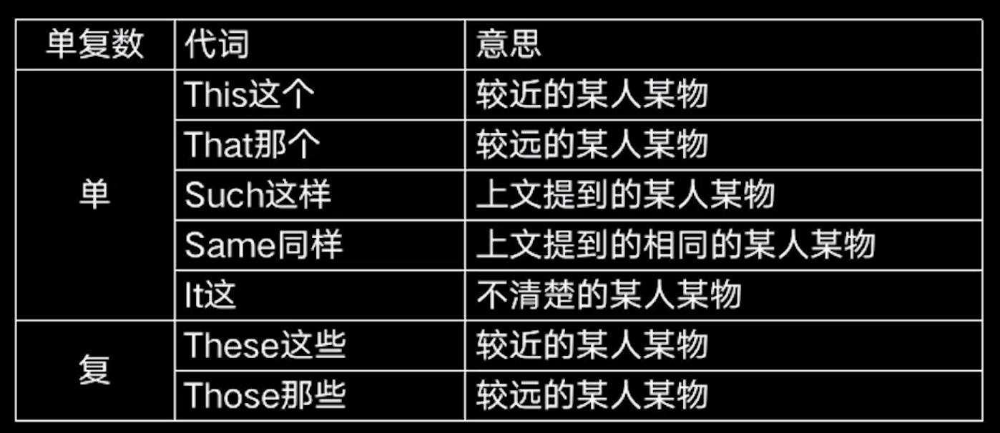

 # 代词

## 代词分类

* 人称代词
* 物主代词
* 反身代词
* 指示代词
* 疑惑代词
* 不定代词
* 相互代词
* 关系代词
* 连接代词


## 人称代词

主语

```
They are students.

It is you.
```

宾语

```
I tell her my name.

I should apologize to her.
```

你我他同时出现时，先说你，再说他，最后说我。

```
You and he.

He and me.

You and he and me are all students.
```

It的用法

```
天气
It is cloudy.

时间
It is 6 o'clock.

距离
It is 5 miles.

环境
It is desert.

指上文提过的某物
I have a cute cat, and it has blue eyes.

不知道性别的人
She has a cute baby, and it has blue eyes.

已经发生的、正在发生的
Stop it.

打电话分辨人
Hello, Peter, it's Jack here.

做形式主语
It is confident that he will win the match.

做形式宾语
I realized it tough to learn ski well.
```


## 物主代词

形容性物主代词，作名词的修饰（的），后面加名词

```
She is my aunt.

They are their cars.
```

名词性物主代词，相当于名词，表示事物又表明所属

```
You're not mine.

Your house is huge, but ours is rather small.
```

双重所有格，of + 名词性物主代词

```
He is a friend of mine.

An old friend of mine.
```


## 反身代词

表示什么......自己

做宾语，指一个动作反馈到动作发出者身上

```
Stop! You might burn yourself.
```

做同位语，表示强调，解释说明，强调名词或者代词

```
The book itself is interesting.
```

转换对应图




## 指示代词

说明近处远处、上下文的人或物




## 疑问代词

用来提出问题的代词，不分单复数，有修饰的名词决定

```
what, who, whose, whom, which, whatever, whichever, whoever, whomever
```


## 不定代词

代替或者修饰不确定的人或物，可以做主语宾语表语定语状语

```
单数
some、any、each、every、either、neither等
复数
many、few、ones、both、others等
不可数
much、little、all等
复合
something、someone、nothing、nobody等
```


### some和any的区别

some

肯定句，表示几个、一些、某个疑问句，表示建议、请求希望可以修饰可数名词或者不可数名词

```
I have some problems.

Do you want to get some drinks.
```


any

肯定句，表示任何的

疑问句或者否定句，表示任何一些、任何一个可以修饰可数名词或者不可数名词

```
I don't get any question.

Do you have any drinks?
```


### no和none的区别

no

做定语，表示没有

可以修饰可数名词或者不可数名词

```
We are no time.

I have no answer to these.
```


none

做主语宾语表语，表示没有一个人/物

可以修饰可数名词或者不可数名词

```
None escape the tomb.

None of them could escape.
```


### all和both的区别

all

指三者或者以上的人或者物

可以修饰可数名词或者不可数名词

```
I know all of the five Chinese students.
```


both

指两个人或者物

可以修饰可数名词

```
They both spoke together.
```


### every和each的区别

every

表示每一个，指3个或者3个以上的整体中的每一个，侧重于整体

形容词只能做定语，可以修饰单数名词

```
I eat vagetables every day.
```


each

表示每个各个，指两个或者两个以上中的每一个，强调个别

代词做主语宾语定语

```
Each life is precious.
```


### either和neither的区别

neither

表示either的否定形式，两个都不

```
I now neither of them.
```


### other和the other和another的区别

other

表示不同种类的另一个，其余

```
Do you like other styles？
```


another

表示同种类的另一个，又一个

```
I have another story.
```


the other

表示两个里面的另一个

```
Why not try the other box?
```


### others和the others的区别

others

表示其余的人或物，指大部分

```
Some students are playing football, and others are watching them
```


the others

表示其余的人或者物，指除了xx的全部

```
John and the others are here
```


### many和much的区别

many

表示很多，跟可数名词复数连用

```
I have many friends.
```


much

表示很多，跟不可数名词连用

```
I have much time.
```


### 复合名词的区别

something、anything、nothing、everything、somebody、anybody、nobody、everybody、someone、anyone、everyone、no one

合成不定代词谓语动词用单数

some-，every-开头的用在肯定句中

any-开头的用在否定句和疑问句和条件状语从句中

no-开头的用在否定句中

-thing结尾指物，-one，-body结尾指人

no one 和nobody指人，后面不能跟of，谓语用单数

none指人指物，后面能跟of，谓语动词单数复数都行


```
Almost no one believed hime.
几乎没有人相信他

None of us agreed with him.
我们都不同意他的看法
```


### a lot of、lots of、a number of、large number of、a great deal of、plenty of的区别

a lot of、lots of、 plenty of修饰可数名词复数和不可数名词

a number of、large number of修饰可数名词复数

a great deal of修饰不可数名词

```
A lot of people overlook to keep health.

A number of apples are green.

A great deal of time can rest.
```


### few和a few，little和a little的区别

few/a few跟可数名词连用，或者代指可数事务

little/a little跟不可数名词连用，或者指代不可数事务

否定表达

few很少几个；little少到几乎没有

肯定表达

a few有几个；a little有一些

```
I have few apples.
我苹果很少

I have little water.
我水很少

I have a few apples.
我有几个苹果

I have a little water.
我有一点水
```


## 相互代词

表示相互关系的代词

each other、 one other

```
You can test each other.
你可以互相考验对方

we're still attracted to one another.
我们依然喜欢彼此
```


## 关系代词

用来引导定语从句的代词，充当定语从句成分

```
who指人，在定语从句中作主语
whom指人，在定语从句中做宾语
which指物，在定语从句中做主语或者宾语

that指人，相当于who和whom
that指物，相当于which
在定语从句中作主语或者宾语
```


## 连接代词

用于引导名词性从句（主语从句、宾语从句、表语从句）

what什么、who谁、which哪个、whose谁的等等