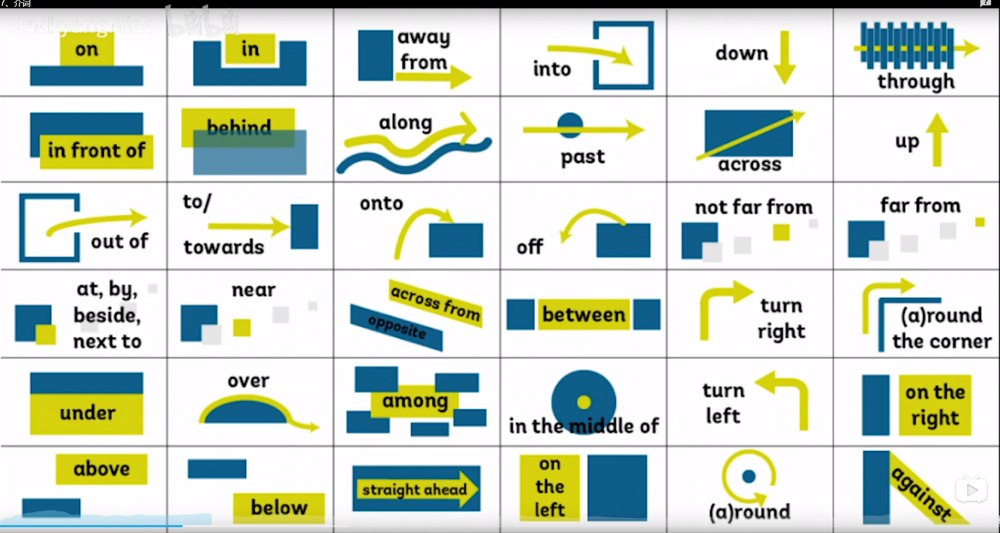

# 介词

## 介词作用

* 定语 The method of success;
* 状语 She lives in Vancouver.
* 表语 It is in the right screw.
* 宾补 He put the cellphone on the desk.
* 同位语As a doctor, he is responsible for his patient.


## 常见介词的语义




## 易混介词

###地点on、in、at

at某个具体位置、加小地点

```
At bus station.
At No.12 avenue.
```

in后面跟大地点

```
In Beijing.
```

on表示在上面，后面加楼层

```
On the 1th floor.
```


### 时间on、in、at

at后面跟具体时刻，一天中的具体时间点，具体的周和节日

```
At midnight.
```

on后面跟具体的时间，某年某月某日星期几

```
On Monday September 2th 2019.
```

in后面跟年、月、早晚、季节、一段时间，将来时中表示一段时间之后

```
In Spring.
We will meet in a few days.
```


### 方位on、in、to

in是a在b里面

```
Kunming lies in the southwest of China.
```

on是a和b连着

```
Canada lies on the north of American.
```

to是a和b不连着

```
Japan lies to the east of China.
```

to表示方向

```
to the south.
```

on表示左右

```
on the left.
```


### 时间after、in

after+具体时刻或者从句：表示在什么时刻之后，跟一般时态

```
I was always playing football after school.
```

in+一段时间：表示多久之后，跟将来时态

```
We will study math in a new semester.
```


### 时间since、for

since+具体时刻或者从句：自从什么时候起，一直到现在

```
Since Ford died, that's all changed.
```

for+一段时间：总共有多长之久

```
The school history for two hundred years.
```