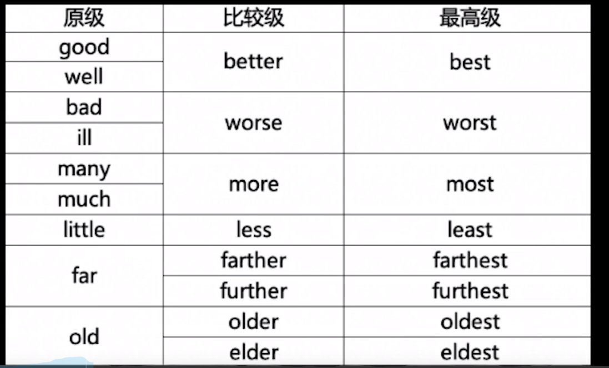

# 形容词

## 形容词分类

### 按属性分

属性：（表示人和物具有的属性）可以加Very修饰beautiful

类别：（表示事务的类别）不可以加Very修饰empty、Chinese

颜色：浅色前面加light、pale、bright、深色前面加dark、deep

强调：absolute、utter、total、entire等等

-ing和-ed：某人某事某种情况的特点表示令人感觉boring

复合：形容词+名词+ed、形容词/副词+过去分词、形容词/副词/名词+现在分词+形容词


### 按照种类顺序使用

限定词：a、an、the、my、your、our

描绘词：beautiful、boring

大小长短：big、small、tall、short

形状重量：sphere、fat、skinny

状态：cold、wet、rich

新旧：new、old、ancient

颜色：yellow、red、blue

图案：spotted、flowery

国籍：Chinese、American、Australian

物质：wooden、paper、platinum

类别：working、sleeping、classic


## 形容词顺序

限描大形状 新颜图 国物类

```
This is a beautiful small wooden table.
		限定 描述     大小   物质
		
This is a beautiful big sphere broken old yellow patterned American cupreous.
```


## 形容词用法

定语、表语、宾补、状语、一类人

```
作定语
The ship is huge.

作表语
The books are interesting.

作宾补
The music makes me happy.

作状语
I am off duty now, tired and sleepy.

The + 形容词，代表一类人
The old.
```


## 比较级

**规则变化**

```
单音节词和少数双音节词，比较级加er最高级加est
warm - warmer - warmset

元音加上辅助字母结尾，双写辅音字母，比较级加er最高级加est
big - bigger - biggest

如果是e结尾，比较级加r最高级加st
large - larger - largest

如果是y结尾，把y变成i，比较级加er最高级加est
happy - happier - happiest

如果是多音节词，在蛋前面加，比较级加more最高级加most
fantastic - more fantastic - most fantastic
```

**不规则变化**



比较级and比较级，表示越来越

```
faster and faster
```

如果是多音节，单词只需写一个

```
more and more fantastic
```

the比较级...the比较级，表示越怎么越怎么

```
The richer, the more badass.
```

no more than：只有

```
I have no more than four games. 我只有四款游戏
```

not more than：不超过

```
I have not more than four games. 
```


## 形容词易混

good、well

```
good用在定语或者表语
It is good.

well用在状语
Study well and improve every day.
```

nice、fine

```
nice表示令人愉悦，指物外表
nice kill

fine表示身体好
I'm fine
```

lonely、alone

```
lonely表示孤独的，真的孤独
The lonely student is starving for friendship.

alone表示独自的，不一定孤独
I live alone.
```

quick、fast、soon

```
qucik和fast表示速度快
He is a quick man.

soon表示时间快
come soon.
```

interesting、interested

```
interesting：令...感兴趣
The books is very interesting.

interested：对...感兴趣
They are insterested in English.
```

