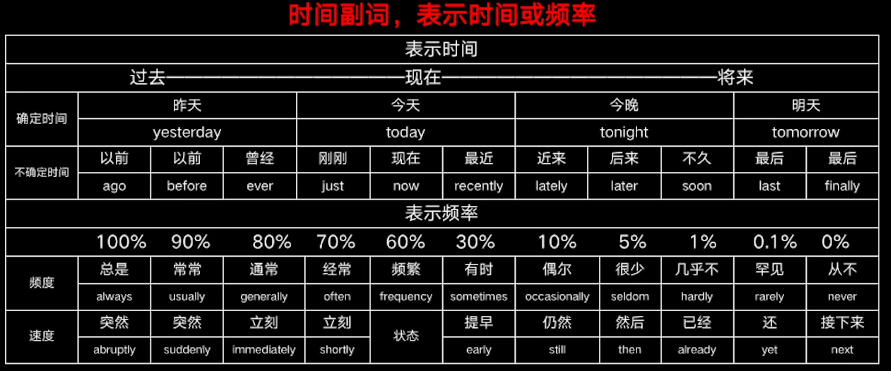

# 副词

## 副词分类



地点副词

````
Here is the remains of a mosque.
````

方式副词

```
Now listen carefully.
```

程度副词

```
It is running very fast.
```

疑问副词

```
Where are you going?
```

强调副词

```
A really cold day.
```

连接副词

```
The problem is how he can do it.
```

关系副词

```
I never forget the day when I got the award.
```


## 副词的结构

```
careful => carefully
beautiful => beautifully
important => imprtantly
```

大部分以y结尾变副词，变y为i加ly

```
lucky => luckily
busy => busily
dirty => dirtily
```

 

## 副词用法

```
I took carefully the bady. ×
I took the baby carefully. √
```

作状语

```
Look at the photo carefully.
```

作表语s

```
The meeting is over.
```

作定语

```
The shops around are very cheap.
```

作宾补

```
You come so late.
```

