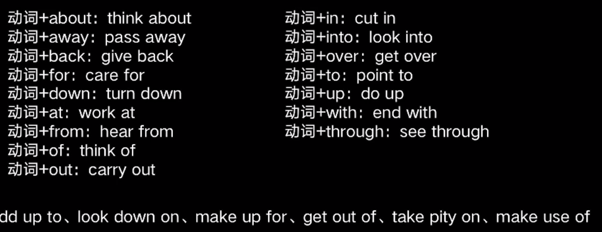

# 动词分类

* 能做谓语
  * 实意动词
    * walk
    * eat
    * make
  * 系动词
    * is
    * are 
    * look
  * 静态动词
    * own 
    * cost
    * consist
  * 动词短语
    * come out
    * depend on 
    * pay off
* 不能做谓语，加动词一起可以做谓语
  * 助动词
    * have
    * do 
    * shall
    * will
    * should
    * can
  * 情态动词
    * can
    * may
    * must
    * need


## 实意动词

表示动词、及物动词和不及物动词

```
I hate you.
I fly.
```

不及物动词不可能转为被动形式。


## 系动词

引导表语或者表语从句

```
I am Jack.
```


### 静态动词

表示拥有、情感、思想的动词

```
拥有
have、own、want、contain
情感
love、hate、want、need
思想
know、think、understand、believe
```


## 动词短语

动词+介词或者动词加副词，构成与原来动词不一样的意思




## 助动词

协助主要动词构成谓语的次，没有实际意思，不能单独用，构成时态、语态、否定句、强调句、疑问句

代表词have、do、be

```
I have turned off the light.

Do you have kids?

I am watching this video.
```


## 情态动词

有含义、要和动词原形在一起构成谓语

can/could 表示推测、允许、能力

```
You can imagine the story is bad.

You could have been hurt.
```

may/might 表示推测、允许、请求、住院

```
It may rain today.

I might be the next lucky doy.
```

be able to 能够

have to 必须

had better 最好