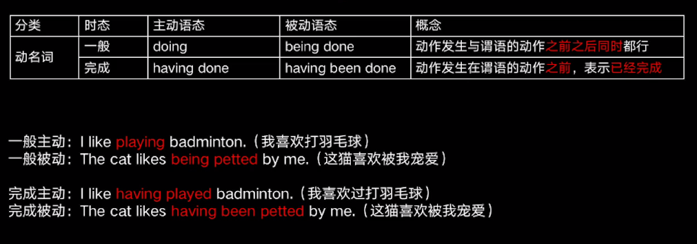

# 非谓语动词

不做谓语的动词，不定式，动名词，（现在过去）分词


## 不定式

大多数都是to+动词不定式，还有些是没有to动词不定式

```
I like to clean.

I can do it.
```

**什么时候不加to**

* 跟助动词can、could、might等
* 跟感官动词see、watch、observe等
* 跟使役动词let、make、have等
* 跟why （not）
* 跟know
* 跟介词except、but
* 主语部分带do不定式做表语省略to
* 当两个或多个作用相同的不定式并列时，第一个不定式前用to，其余不定式前的to可以省略


## 动名词

动词加ing起名词作用




## 过去分词

表被动。

```
He is interested in the news.
```

